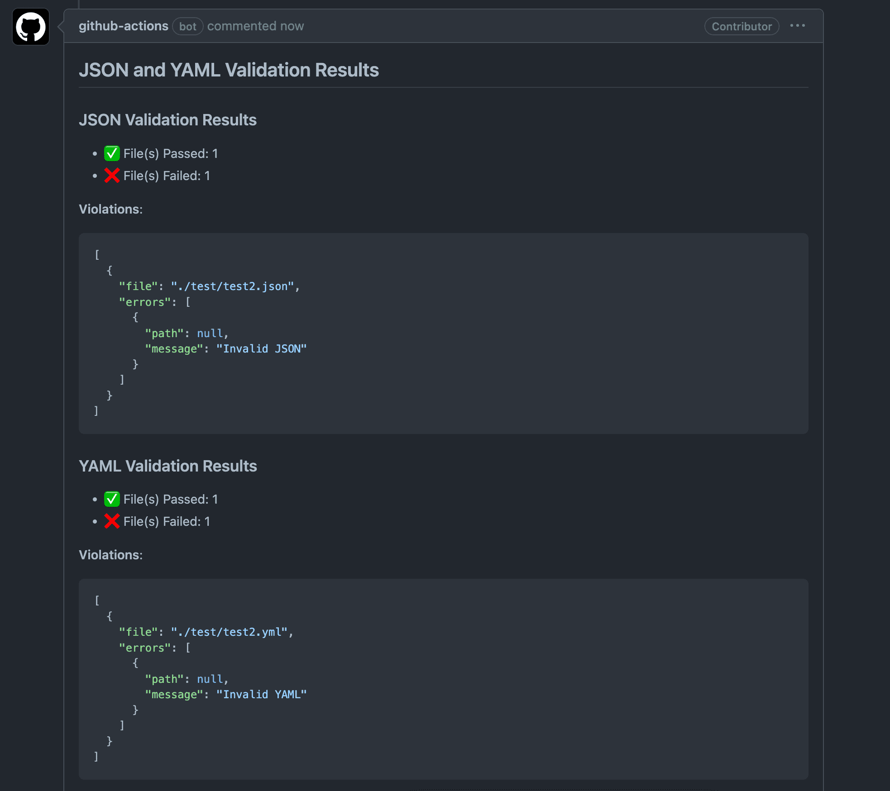

# JSON and YAML - Validator ✅

[](https://github.com/grantbirki/json-yaml-validate/actions/workflows/test.yml)
[](https://github.com/GrantBirki/json-yaml-validate/actions/workflows/acceptance.yml)
[](https://github.com/grantbirki/json-yaml-validate/actions/workflows/package-check.yml)
[](https://github.com/grantbirki/json-yaml-validate/actions/workflows/lint.yml)
[](./badges/coverage.svg)

A GitHub Action to quickly validate JSON and YAML files in a repository

## About 💡

This action comes pre-packaged with JSON and YAML validation support:

- JSON validation with [ajv](https://github.com/ajv-validator/ajv) - The fastest NodeJS JSON validator
- YAML parsing and legacy YAML schema validation implemented in native TypeScript

If you have a repository containing JSON or YAML files and want to validate them extremely quickly, this action is for you!

You can provide schemas to check against, or just validate the syntax of the files. This comes very handy when you want to ensure that your JSON and YAML files are valid before committing them to your repository, especially from pull requests.

This Action is also designed to stay fast while keeping its dependency surface small. It uses native recursive directory discovery for normal scans and Node's native glob expansion when the `files` input is provided.

## Installation 📦

Here is a quick example of how to install this action in any workflow:

```yaml
# checkout the repository (required for this Action to work)
- uses: actions/checkout@v6

# validate JSON and YAML files
- name: json-yaml-validate
  uses: GrantBirki/json-yaml-validate@v4
```

## Inputs 📥

| Input | Required? | Default | Description |
| ----- | --------- | ------- | ----------- |
| `mode` | `false` | `"fail"` | The mode to run the action in `"warn"` or `"fail"` |
| `comment` | `false` | `"false"` | Whether or not to comment on a PR with the validation results - `"true"` or `"false"` |
| `comment_on_success` | `false` | `"false"` | Whether or not to comment on a PR when all validation checks pass - `"true"` or `"false"` |
| `update_comment` | `false` | `"false"` | Whether or not to update an existing validation results PR comment authored by `github-actions[bot]` instead of creating a new one - `"true"` or `"false"` |
| `base_dir` | `false` | `"."` | The base directory to search for JSON and YAML files (e.g. ./src) - Default is `"."` which searches the entire repository |
| `files` | `false` | `""` | List of file paths to validate. File paths may be newline-delimited or provided as a single space-separated line. |
| `schema_mappings` | `false` | `""` | YAML list that maps JSON or YAML schema files to explicit file patterns for multi-schema validation |
| `use_inline_schema` | `false` | `"false"` | Whether or not to use local inline JSON Schema references in JSON files and YAML language-server schema comments when YAML is validated as JSON |
| `use_dot_match` | `false` | `"true"` | Whether or not to use dot-matching when searching for files - `"true"` or `"false"` - If this is true, directories like `.github`, etc will be searched |
| `json_schema` | `false` | `""` | The full path to the JSON schema file (e.g. ./schemas/schema.json) - Default is `""` which doesn't enforce a strict schema |
| `json_schema_version` | `false` | `"draft-07"` | The version of the JSON schema to use - `"draft-07"`, `"draft-04"`, `"draft-2019-09"`, `"draft-2020-12"` |
| `json_extension` | `false` | `".json"` | The file extension for JSON files (e.g. .json) |
| `json_exclude_regex` | `false` | `""` | A regex to exclude files from validation (e.g. `".*\.schema\.json$"` to exclude all files ending with `.schema.json`) - Default is `""` which doesn't exclude any files |
| `use_ajv_formats` | `false` | `"true"` | Whether or not to use the [AJV formats](https://github.com/ajv-validator/ajv-formats) with the JSON processor |
| `yaml_schema` | `false` | `""` | The full path to the YAML schema file (e.g. ./schemas/schema.yaml) - Default is `""` which doesn't enforce a strict schema |
| `yaml_extension` | `false` | `".yaml"` | The file extension for YAML files (e.g. .yaml) |
| `yaml_extension_short` | `false` | `".yml"` | The "short" file extension for YAML files (e.g. .yml) |
| `yaml_exclude_regex` | `false` | `""` | A regex to exclude files from validation (e.g. `".*\.schema\.yaml$"` to exclude all files ending with `.schema.yaml`) - Default is `""` which doesn't exclude any files |
| `yaml_as_json` | `false` | `"false"` | Whether or not to treat and validate YAML files as JSON files - `"true"` or `"false"` - Default is `"false"`. If this is true, the JSON schema will be used to validate YAML files. Any YAML schemas will be ignored. For this context, a YAML file is any file which matches the yaml_extension or yaml_extension_short inputs. See the [docs](docs/yaml_as_json.md) for more details |
| `exclude_file` | `false` | `""` | The full path to a file in the repository where this Action is running that contains a list of '.gitignore'-style patterns to exclude files from validation (e.g. ./exclude.txt) |
| `exclude_file_required` | `true` | `"true"` | Whether or not the `exclude_file` must exist if it is used. If this is `true` and the `exclude_file` does not exist, the Action will fail. Set this to `"false"` if you do not care when the `exclude_file` exists or not |
| `use_gitignore` | `true` | `"true"` | Whether or not to use the .gitignore file in the root of the repository to exclude files from validation - `"true"` or `"false"` - Default is `"true"` |
| `git_ignore_path` | `false` | `".gitignore"` | The full path to the .gitignore file to use if use_gitignore is set to "true" (e.g. ./src/.gitignore) - Default is ".gitignore" which uses the .gitignore file in the root of the repository |
| `allow_multiple_documents` | `false` | `"true"` | Whether or not to allow multiple documents in a single YAML file - `"true"` or `"false"` - Default is `"true"`. Set to `"false"` to reject Kubernetes-style multi-document YAML files. |
| `ajv_strict_mode` | `false` | `"true"` | Whether or not to use strict mode for AJV - "true" or "false" - Default is "true" |
| `ajv_custom_regexp_formats` | `false` | `""` | List of key value pairs of `format_name=regexp`. Each pair must be on a newline. (e.g. `lowercase_chars=^[a-z]*$` - See below for more details) |
| `github_token` | `false` | `${{ github.token }}` | The GitHub token used to create an authenticated client - Provided for you by default! |

## Outputs 📤

| Output | Description |
| ------ | ----------- |
| `success` | Whether or not the validation was successful for all files - `"true"` or `"false"` |

## Usage 🚀

Here are some basic usage examples for this Action

### Basic

```yaml
name: json-yaml-validate 
on:
  push:
    branches:
      - main
  pull_request:
  workflow_dispatch:

permissions:
  contents: read

jobs:
  json-yaml-validate:
    runs-on: ubuntu-latest
    steps:
      - uses: actions/checkout@v6

      - name: json-yaml-validate
        id: json-yaml-validate
        uses: GrantBirki/json-yaml-validate@v4
```

### Pull Request Comment

Here is a usage example in the context of a pull request with comment mode enabled:

```yaml
name: json-yaml-validate 
on:
  push:
    branches:
      - main
  pull_request:
  workflow_dispatch:

permissions:
  contents: read
  pull-requests: write # enable write permissions for pull request comments

jobs:
  json-yaml-validate:
    runs-on: ubuntu-latest
    steps:
      - uses: actions/checkout@v6

      - name: json-yaml-validate
        id: json-yaml-validate
        uses: GrantBirki/json-yaml-validate@v4
        with:
          comment: "true" # enable comment mode
```

The resulting comment will look like this:



When `update_comment` is set to `"true"`, the action only updates an existing
validation results comment authored by `github-actions[bot]`. If no matching
bot-authored validation comment exists, it creates a new comment instead.

### Schema Validation

This Action also supports schema validation for both JSON and YAML files.

References for JSON Schema validation can be found at the link below. The YAML schema syntax supported by this action is documented in the YAML example that follows.

- [JSON Schema Validation Docs](https://ajv.js.org/json-schema.html#json-schema)

> Note: JSON files use AJV JSON Schema. YAML files use this action's legacy YAML schema dialect, which is intentionally smaller and is not JSON Schema.

Assuming the following repository structure:

```text
/
├── schemas/
│   ├── schema.yml
│   └── schema.json
├── data/
│   ├── test.json
│   └── test.yml
└── ...
```

Here is an example of how to use this feature:

```yaml
# checkout the repository
- uses: actions/checkout@v6

- name: json-yaml-validate
  uses: GrantBirki/json-yaml-validate@v4
  with:
    yaml_schema: schemas/schema.yml # validate YAML files against the schema
    json_schema: schemas/schema.json # validate JSON files against the schema
```

When this Action workflow runs, it will validate all JSON and YAML files in the repository against the schema files in the `schemas/` directory.

> If you want to only validate files in the `data/` directory, you could set the `base_dir` input to `data/`

YAML files may contain multiple documents separated by `---`. This is valid
YAML and is common for Kubernetes manifests, so `allow_multiple_documents`
defaults to `"true"`. When `yaml_schema` is set, each YAML document is validated
against the configured schema. Set `allow_multiple_documents: "false"` when a
workflow should reject files that contain more than one YAML document.

### Multiple Schema Mappings

Use `schema_mappings` when different file groups need different schemas in the same action step. When this input is set, the mappings are authoritative: the action validates only files matched by the mapping entries and does not fall back to `base_dir`, `files`, `json_schema`, or `yaml_schema`. See [schema mappings docs](docs/schema_mappings.md) for the detailed behavior.

Each mapping entry requires:

- `type`: either `json` or `yaml`
- `schema`: the schema file for that entry
- `files`: one file pattern, or a list of file patterns
- `json_schema_version`: optional for JSON mappings, defaulting to the top-level `json_schema_version`

```yaml
- name: json-yaml-validate
  uses: GrantBirki/json-yaml-validate@v4
  with:
    schema_mappings: |
      - type: json
        schema: ./schemas/index-schema.json
        files:
          - ./data/index_*.json
        json_schema_version: draft-07
      - type: json
        schema: ./schemas/topic-schema.json
        files:
          - ./data/topic_*.json
      - type: yaml
        schema: ./schemas/config-schema.yaml
        files:
          - ./config/*.yaml
          - ./config/*.yml
```

`schema_mappings` still uses the global exclude options, AJV options, `yaml_as_json`, and `allow_multiple_documents` where those options apply. YAML schema mappings cannot be used when `yaml_as_json` is `"true"` because YAML schemas are ignored in that mode.

### Inline Schemas

Use `use_inline_schema` when files already declare their JSON Schema locally and you do not want to duplicate that mapping in workflow YAML. JSON files can declare a top-level `$schema` value, and YAML files can declare a leading `# yaml-language-server: $schema=...` comment when `yaml_as_json` is `"true"`.

```yaml
- name: json-yaml-validate
  uses: GrantBirki/json-yaml-validate@v4
  with:
    use_inline_schema: "true"
    yaml_as_json: "true"
```

Inline schema references are local-only. Relative schema paths are resolved from the file being validated, absolute schema paths must stay inside the workspace, and arbitrary remote `http://` or `https://` schemas are rejected instead of fetched. `schema_mappings` and explicit `json_schema` inputs take precedence over inline schemas. See [inline schema docs](docs/inline_schema.md) for detailed behavior.

### JSON Schema Docs

For validating a `.json` file with a `.json` schema

#### JSON Input Example

```json
{
  "foo": 1,
  "bar": "abc"
}

```

#### JSON Schema Example

```json
{
  "type": "object",
  "properties": {
    "foo": {
      "type": "integer"
    },
    "bar": {
      "type": "string"
    }
  },
  "required": [
    "foo"
  ],
  "additionalProperties": false
}
```

Details on the fields seen in the schema above:

- `type` - the type of the value, can be one of `string`, `number`, `integer`, `boolean`, `array`, `object`, `null`
- `required` - an array of strings, each of which is a property name that is required
- `additionalProperties` - a boolean value that determines if additional properties are allowed in the object

### JSON Schema with Custom Regex Formats

You can also use custom regex formats in your JSON schema. This is useful for validating specific formats of strings. This section describes how you can use custom regex formats with this Action.

#### JSON Schema Example with Custom Regex Formats

Here is an example JSON schema that uses custom regex formats:

> For this example, assume that the JSON schema's file path is `./schemas/custom_with_regex.json` from the root of the repository

```json
{
  "type": "object",
  "properties": {
    "lowercase_char_property": {
      "type": "string",
      "format": "lowercase_char"
    },
    "lowercase_alphanumeric_property": {
      "type": "string",
      "format": "lowercase_alphanumeric"
    }
  },
  "required": ["lowercase_char_property", "lowercase_alphanumeric_property"],
  "additionalProperties": false
}
```

#### JSON Input Example with Custom Regex Formats

Here is an example file that we are going to validate against the schema above:

> For this example, assume that the JSON file's file path is `config/valid.json` from the root of the repository

```json
{
  "lowercase_char_property": "valid",
  "lowercase_alphanumeric_property": "valid1"
}
```

#### Custom Regex Formats - Action Input

Now that we have a JSON schema that uses custom regex formats and a JSON file that we want to validate against the schema, we need to provide the custom regex formats to the Action. The example workflow step below shows how to do this:

```yaml
- name: json-yaml-validate
  uses: GrantBirki/json-yaml-validate@v4
  id: json-yaml-validate
  with:
    json_schema: ./schemas/custom_with_regex.json # <--- the schema file that uses custom regex formats
    ajv_custom_regexp_formats: |
      lowercase_char=^[a-z]*$
      lowercase_alphanumeric=^[a-z0-9]*$
    # ^ these are the custom regex formats used in the schema that we inject into the Action so they can be used
    files: |
      config/valid.json
    # ^ uses the example file as seen in the section above
```

The `ajv_custom_regexp_formats` input is a multi-line string that contains the custom regex formats used in the JSON schema. Each line in the string should be in the format `format_name=regex_pattern`. The `format_name` is the name of the custom regex format used in the schema, and `regex_pattern` is the regex pattern that the value in the JSON file must match.

### YAML Schema Docs

For validating a `.yaml` file with a `.yaml` schema

> Note: can also be `.yml` files, both work

#### YAML Input Example

The following is a sample yaml file to input into the validator schema which will be seen below:

```yaml
---
person:
  name:
    first_name: monalisa
  age: 2000
  employed: true
  hobbies:
    - tennis
    - football

```

#### YAML Schema Example

The schema used to validate the input file from above:

```yaml
---
person:
  name:
    first_name:
      type: string
      length: # define min and max length (optional)
        min: 2
        max: 10
  age:
    type: number
    required: true # make this field required (optional)
  employed:
    type: boolean
  hobbies:
    - type: string
      enum: [football, basketball, tennis] # only accept these values (optional)
```

Details on the fields seen in the schema above:

- `type` - The type of the field (e.g. `string`, `number`, `boolean`, etc)
- `length` - The length of the field with `min` and `max` constraints
- `required` - Whether or not the field is required
- `enum` - An array of accepted values for the field

## Excluding Files

There are three main ways you can go about excluding files from being validated with this Action:

- `json_exclude_regex` - A regex string that will be used to exclude **JSON** files from being validated
- `yaml_exclude_regex` - A regex string that will be used to exclude **YAML** files from being validated
- `exclude_file` - **best** way to exclude files - A file that contains a list of files to exclude from being validated in *gitignore* format

> It should be strongly noted that both `json_exclude_regex` and `yaml_exclude_regex` options get unwieldy very quickly and are not recommended. The `exclude_file` option is the best way to exclude files from being validated. Especially if you have a large repository with many files.

Example of an `exclude_file`'s contents:

```python
# exclude all files in the test/ directory
test/

# exclude a yaml file at an exact path
src/cool-path/example.yaml

# exclude all json files with some glob matching
*.test.json
```

If the file path to your `exclude_file` is `exclude.txt`, you would set the `exclude_file` input to `exclude.txt` like so:

```yaml
# checkout the repository
- uses: actions/checkout@v6

- name: json-yaml-validate
  uses: GrantBirki/json-yaml-validate@v4
  with:
    exclude_file: exclude.txt # gitignore style file that contains a list of files to exclude
```

## Violations Structure Explained

Below is a very simple example of a violation warning that you might see in this Action in your Action's logs or as a comment on a pull request:

```json
[
  {
    "file": "./test/test2.json",
    "errors": [
      {
        "path": null,
        "message": "Invalid JSON"
      }
    ]
  },
  {
    "file": "./test/test3.yaml",
    "errors": [
      {
        "path": "person.age",
        "message": "person.age must be of type String."
      }
    ]
  }
]
```

The example above contains two violations - one for a JSON file and one for a YAML file. Here is what each of the fields mean:

- `file` - The full path to file that the violation occurred in
- `errors` - An array of errors that occurred in the file
  - `path` - The path to the error in the file (if applicable) - Note: This is **not** the file path but rather the path place within the file that the error occurred
  - `message` - The error message

In the example above, the `path` for the JSON file is `null` and the message says `Invalid JSON`. This means that the entire file could not be parsed as JSON. Likewise, if you see `null` for the `path` and the message says `Invalid YAML`, this means that the entire file could not be parsed as YAML.

## Known Issues

This section documents known issues and workarounds / fixes

### .gitignore directory exclusion

If you plan on using your `.gitignore` file, you should always include a trailing slash when excluding a directory. For example, instead of `node_modules` use `node_modules/`. This will ensure the Action correctly detects the directory as a directory and not a file.
